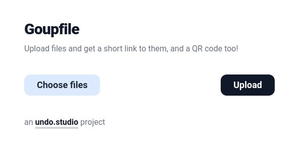
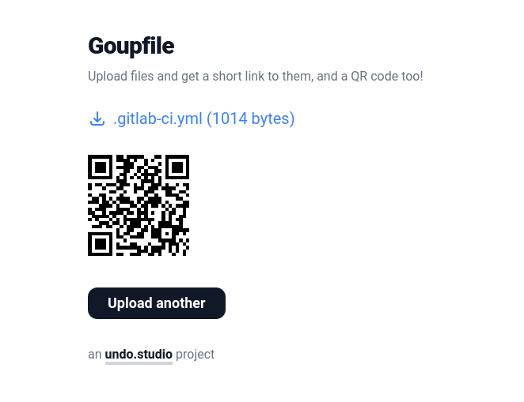

# Goupfile [](https://github.com/goupfile/server/actions) [](https://goreportcard.com/report/github.com/goupfile/server)

Goupfile is a file sharing service.

## Features

What makes this one different?

- Share multiple files under one URL
- URLs are short, memorable, and don't have ambiguous characters
- QR codes so that you can upload files on one device and easily access them on another
- Upload from any browser at [goupfile.com](https://goupfile.com)
- There's a [CLI tool](https://github.com/goupfile/up) for uploading files from the terminal
- No dependencies: it uses a [SQLite database](#database-notes) and saves files to the local filesystem
- Easy to deploy: just download a single binary and run
- Lightweight: runs on any machine in the cloud

## HTTP API

```
GET    /                   Show the home page and upload/download from there
POST   /upload             Upload a file (use multipart/form-data)
GET    /d/{id}             Download a file
GET    /v/{id}             View file download page
```

## Configuration

In [main.go](main.go), there is a block where you can configure Goupfile. For
example, you can change the directory where uploaded files are stored.

```go
const (
	scheme     = "http"
	host       = "localhost"
	port       = ":8090"
	staticDir  = "./public"
	driver     = "sqlite3"
	dataSource = "sqlite_db"
)
```

### Proxying though nginx

It's common to proxy requests through a server like nginx. This allows you to
simply run Goupfile on something like http://localhost:8090 and have nginx take
care of the public facing TLS, hostname, and other configuration.

One configuration that's useful to adjust for an application like Goupfile is
`client_max_body_size` which allows you to specify a limit on how large an
uploaded file can be.

```
server {
	server_name          goupfile.com;
	listen               *:80;
	listen               [::]:80;

	return 301 https://goupfile.com$request_uri;
}

server {
	listen [::]:443 ssl http2;
	listen 443 ssl http2;

	ssl_certificate /path/to/cert;
	ssl_certificate_key /path/to/private/key;

	include /etc/letsencrypt/options-ssl-nginx.conf;
	ssl_dhparam /etc/letsencrypt/ssl-dhparams.pem;

	client_max_body_size 10M;

	location / {
		proxy_pass http://localhost:8090;
	}
}
```

## Developing

Clone the repository:

```
git clone git@github.com:goupfile/server.git
```

Then run the server from the root of the project:

```
go run -v ./...
```

or

```
make run
```

To automatically build and run the project every time a file changes, you can
use a tool like [gow](https://github.com/mitranim/gow).

### Docker

Using Docker, you can build and run Goupfile without having Go installed and
without gcc (since `mattn/go-sqlite3` is a cgo package and relies on gcc).

If you don't already have it, install [Docker Engine](https://docs.docker.com/install/).

```
git clone git@github.com:goupfile/server.git
cd server
npm install && npm run css-prod
docker build . -t goupfile
docker container run -p 8090:8090 goupfile
```

### CSS

This project uses [Tailwind CSS](https://tailwindcss.com/). The following will
create a CSS file with all Tailwind classes, which is helpful in development
because you can use any Tailwind CSS utility. The file produced by `css-dev` is
*over 3 MB*, so don't use it in production!

```sh
npm install
npm run css-dev
```

For a production build,

```sh
npm run css-prod
```

This will produce a CSS file with only the classes you used in the HTML.

## Database notes

Goupfile currently uses SQLite as its database. SQLite has an overview of [use
cases where it works well](https://www.sqlite.org/whentouse.html), and right now
it's a good choice for Goupfile. However, with many concurrent writes or large
numbers of files that don't fit on a single VM's disk, there may be issues. In
that case, it's almost trivial to swap out SQLite for PostgreSQL or MariaDB.
Just change the `driver` and `dataSource` in [main.go](main.go).

## Screenshots





## License

MIT
